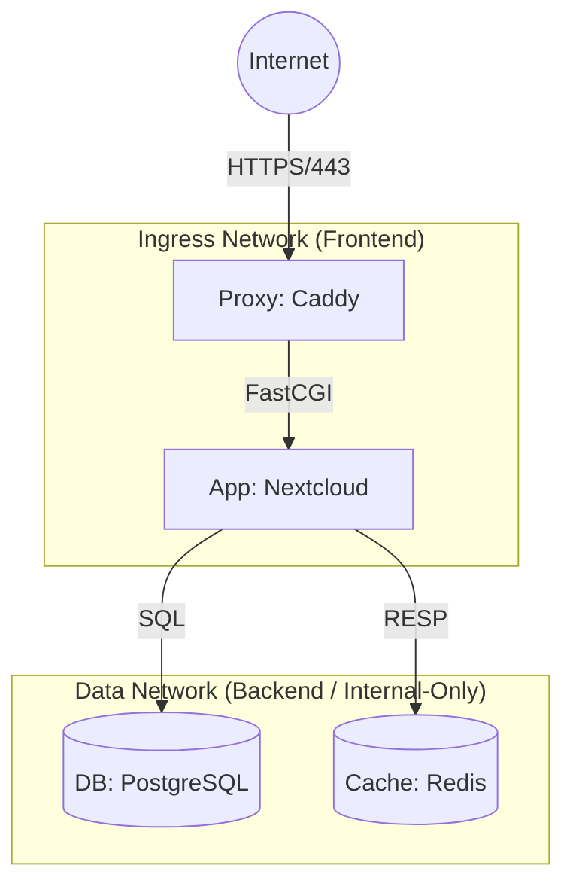

# Architecture Overview

## High-Level Topology

## Component Decisions

### 1. Ingress / Reverse Proxy (Caddy)
**Decision:** Caddy is included as the **Application Gateway**.
*   **Role:** It handles application-specific routing (CalDAV redirects), static asset serving, and strict security headers closer to the app.
*   **Deployment:** 
    *   *Standalone:* Binds ports 80/443 directly.
    *   *Behind Edge Proxy:* Change `docker-compose.yml` to expose ports locally or on an internal Docker network, and forward traffic from your edge Nginx/Traefik.

### 2. Database (PostgreSQL)
**Decision:** PostgreSQL 16+ is chosen over MariaDB.
*   **Reasoning:**
    *   **Concurrency:** PostgreSQL's MVCC (Multi-Version Concurrency Control) handles Nextcloud's heavy read/write patterns better than MariaDB under load.
    *   **Reliability:** Strict ACID compliance and robust write-ahead logging (WAL).

### 3. Application Runtime (Stateless)
**Decision:** `nextcloud:fpm-alpine`.
*   **Static Assets:** Shared via volume mount with Caddy for high-performance zero-copy serving.
*   **PHP:** Isolated in the FPM container, scaled independently.

---

## Network Isolation Strategy

The architecture employs **strict network segmentation** to enforce Least Privilege:

| Network | Type | Scope | Trust Level |
|---------|------|-------|-------------|
| `ingress_net` | Bridge | Ingress <-> Application | **Low**. Exposed to handling external HTTP requests. |
| `data_net` | Internal | Application <-> DB/Redis | **High**. No internet access. Contains PII and data. |

> **Security Note:** The Database and Redis containers are attached *only* to `data_net` and cannot establish outbound connections to the internet.

---

## Resource Governance

To prevent "Noisy Neighbor" effects on the VPS, explicit limits are enforced via `docker-compose.yml`:

*   **App:** Capped at 1 vCPU / 1GB RAM.
*   **Database:** Reserved memory guarantees to prevent OOM kills.
*   **Ingress:** Minimal footprint (< 0.5 CPU).

These limits ensure that a runaway PHP process cannot crash the SSH daemon or other workloads.
