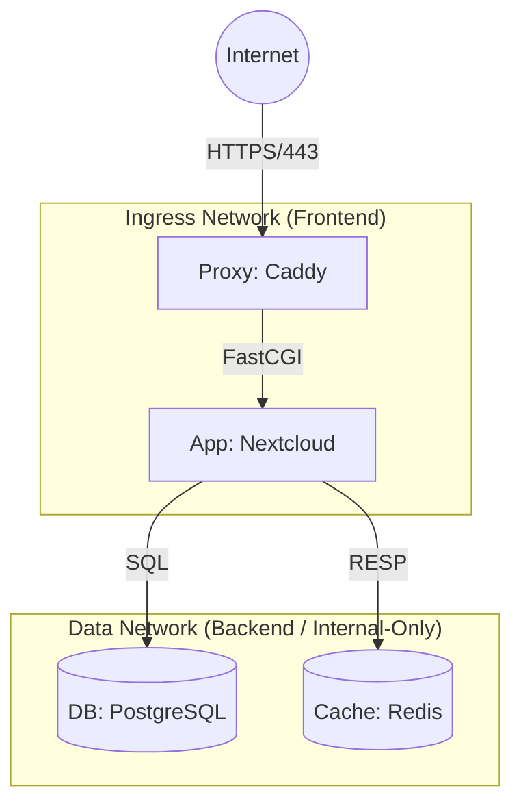

# Architecture Overview

## High-Level Topology

## Component Decisions

### 1. Ingress / Reverse Proxy (Caddy)
**Decision:** Caddy is included as the reference ingress controller.
*   **Reasoning:** Automatic HTTPS (TLS 1.3), native HTTP/3 support, and simple configuration for Nextcloud-specific headers (HSTS, CalDAV/CardDAV redirects).
*   **Deployment Integration:** In a setup with an existing edge proxy (e.g., Nginx Proxy Manager), this Caddy instance should be treated as the *Application Gateway*, receiving traffic from the edge proxy.

### 2. Database (PostgreSQL)
**Decision:** PostgreSQL 16+ is chosen over MariaDB.
*   **Reasoning:**
    *   **Concurrency:** PostgreSQL's MVCC (Multi-Version Concurrency Control) handles Nextcloud's heavy read/write patterns better than MariaDB under load (syncing thousands of small files).
    *   **Reliability:** Strict ACID compliance and robust write-ahead logging (WAL) provide better data integrity assurances for long-term storage availability.

### 3. Application Runtime (Docker)
**Decision:** Stateless container architecture using `nextcloud:fpm-alpine`.
*   **Reasoning:** Separation of web server (Caddy) and PHP runtime (FPM) allows independent scaling and resource limiting. Alpine base keeps the attack surface minimal.

---

## Network Isolation Strategy

The architecture employs **strict network segmentation** to enforce Least Privilege:

| Network | Type | Scope | Trust Level |
|---------|------|-------|-------------|
| `ingress_net` | Bridge | Ingress <-> Application | **Low**. Exposed to handling external HTTP requests. |
| `data_net` | Internal | Application <-> DB/Redis | **High**. No internet access. Contains PII and data. |

> **Security Note:** The Database and Redis containers are attached *only* to `data_net` and cannot establish outbound connections to the internet, nullifying many C2 (Command & Control) exfiltration vectors.

---

## Resource Governance

To prevent "Noisy Neighbor" effects on the VPS, explicit limits are enforced via `docker-compose.yml`:

*   **App**: Capable of bursting to 1 vCPU / 1GB RAM to handle image processing.
*   **Database**: Guaranteed reserved memory, capped to prevent OOM loops.
*   **Ingress**: Minimal resource footprint defined.

These limits ensure that a runaway PHP process or database query cannot crash the underlying SSH or system services.
